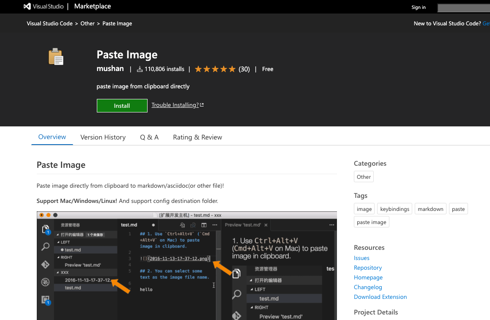

<link href="https://solab-tut.github.io/csss/markdown-pdf.css" rel="stylesheet"></link>

# VSCodeでMarkdown環境を整える

## Editor
- 拡張 `Markdown All in One` を入れる
  
## Preview
- 拡張 `Markdown Preview Enhanced` を入れる
  - 標準？のPreviewerではVSCodeのテーマが反映されてしまい、紙のイメージ（白地に黒）が確認できない

## Paste Image
- 拡張 `Paste Image` （作者 mushan のもの）を入れる。クリップボードから貼り付けてくれる。ファイル本体は同じディレクトリに保存される。
```

```


- サイズを変えたい等の時は img タグで貼り付ける
```
<div style="text-align: center;">

</div>
```
<div style="text-align: center;">

</div>

## PDF化
- 拡張 `Markdown PDF`を入れる
- ヘッダに作成日時を表示させない  
  設定で
  - 数式が表現できない → template.htmlの変更により、**変換時のMathjaxの有効化**を用いる [参考サイト](https://qiita.com/ossyaritoori/items/5e7b3d40505de6288e3c)
    1. `Cmd+Shift+P`でコマンドパレットを呼び出し `Extensions: Open Extensions Folder` でEnterする。
    2. `yzane.markdown-pdf-x.x.x\template` のフォルダに移動する。
    3. `template.html という名前のファイル`を開き，以下の文を追記する。
   
    ```JavaScript
    <script type="text/javascript" src="http://cdn.mathjax.org/mathjax/latest/MathJax.js?config=TeX-AMS-MML_HTMLorMML"></script>
    <script type="text/x-mathjax-config">
        MathJax.Hub.Config({ tex2jax: {inlineMath: [['$', '$']]}, messageStyle: "none" });
    </script>
    ```

### 独自CSSを適用
- Markdownテキストの1行目に以下を書く
  ```
  <link href="https://solab-tut.github.io/csss/markdown-pdf.css" rel="stylesheet"></link>
  ```


# サンプル

## 第2レベルの見出し
### 第3レベルの見出し
#### 第4レベルの見出し
#### 第5レベルの見出し

  > 引用の部分はこのように表示される
  > 引用の部分はこのように表示される
  > 引用の部分はこのように表示される
  > 引用の部分はこのように表示される
  >> 引用の部分はこのように表示される
  >> 引用の部分はこのように表示される
  > 引用の部分はこのように表示される  
  > 引用の部分はこのように表示される
  > 引用の部分はこのように表示される
  > 引用の部分はこのように表示される
  > 引用の部分はこのように表示される
  > 引用の部分はこのように表示される 

```
数式も $e^{i\theta} = \cos\theta + i\sin\theta $ 文章中に記述できる。
```

数式も $e^{i\theta} = \cos\theta + i\sin\theta $ 文章中に記述できる。


- リスト1
    - ネスト リスト1_1
        - ネスト リスト1_1_1
        - ネスト リスト1_1_2
    - ネスト リスト1_2
- リスト2
- リスト3
  
1. 数字付きの箇条書き
2. 数字付きの箇条書き
   1. 数字付きの箇条書き
   2. 数字 _付き_ の箇条書き
      1. 数字 **付き** の箇条書き
3. 数字付きの箇条書き
4. 数字付きの箇条書き

--- 
水平線は `---`

リンクは
```
[Google先生](https://www.google.co.jp/)
```

[Google先生](https://www.google.co.jp/)

~~ruby
　class Hoge
　  def hoge
　    print 'hoge'
　  end
　end
~~

表組み

| header1    |     header2 |   header3    |
| :--------- | ----------: | :----------: |
| align left | align right | align center |
| a          |           b |      c       |


